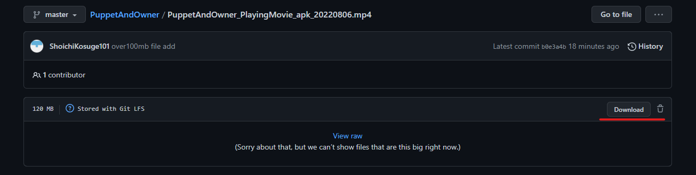

# Puppet and Owner

## 内容物
* PlayMovie  
実機にてプレイした映像となります。  
PC, Oculusにてそれぞれ実施。  

* apkファイル  
VRデバイス(Meta Quest2など)にapkアプリをインストールすることでプレイ可能となります。  
インストール後のプレイまでの流れは各デバイスの実行方法に従ってください。  

## 動画確認 ・ apk DL方法
対象ファイルはGitLFSにてアップロードしておりますので、そのままの視聴は出来ないかと思われます。  

リポジトリ内対象ファイルのURLにアクセス。
(例: https://github.com/ShoichiKosuge101/PuppetAndOwner/blob/master/PuppetAndOwner_PlayingMovie_apk_20220806.mp4 )  
右側の `Download` から対象ファイルをローカルにダウンロード  

ローカルからファイルを実行する。  

## 遊び方
* VRキャラクターはミニキャラクターに視点を移すことができます。
* ミニキャラクターに視点を移してゴールまで導きましょう。
* ミニキャラクターの進路は自分自身では切り開けません。このギミックはVRプレイヤー側で操作することが可能です。
* VRプレイヤーとミニキャラクターを交互に切り替えて、ゴールを目指しましょう。

## バグ
* apk版にてミニキャラクターのアニメーションが再生されない。  
* apk版にてミニキャラクターのカメラが回転する。
* apk版にてミニキャラクターが勝手に移動する。  
